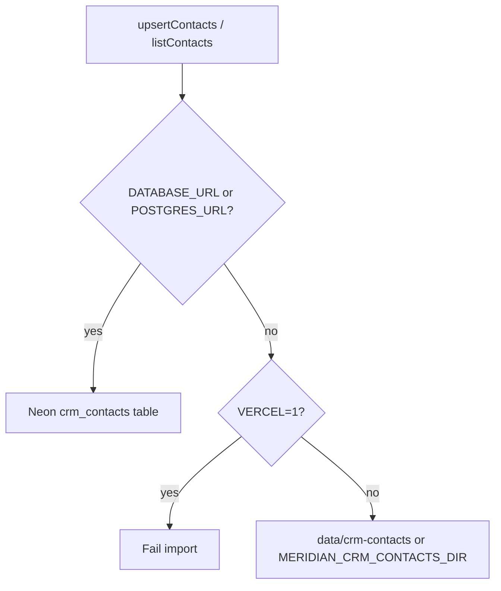

# CRM contact storage

Imported CRM contacts are stored per workspace. Nicole (`nicole-lonergan`) and LaborTech (`labortech`) never share a contact pool — all reads and writes are scoped by `workspace_id`.

## Required environment variables (production)

On Vercel, at least one Postgres URL must be set:

| Variable | Purpose |
|----------|---------|
| `DATABASE_URL` | Preferred Neon/Postgres connection string |
| `POSTGRES_URL` | Alternate connection string (Vercel Postgres, etc.) |

Without either URL, **final import execute fails** with:

> Durable contact storage is not configured.

Preview/mapping jobs may still use in-memory or ephemeral file storage; only persisted contacts require durable storage in production.

Optional (local / hybrid):

| Variable | Purpose |
|----------|---------|
| `MERIDIAN_CRM_CONTACTS_DIR` | Writable directory for per-workspace JSON when no database is configured |

## Storage modes



### Neon / Postgres (production)

- Table: `crm_contacts` (`db/schema/crm-contacts-neon.sql`)
- Primary key: `(workspace_id, contact_id)`
- Upsert on import; list filtered by `workspace_id` only
- Schema is created on first use (`ensureCrmContactsSchema`)

Initialize manually:

```bash
npm run crm:schema:init
```

### Local file fallback

When no database URL is set **and** the process is not on Vercel:

- Contacts: `data/crm-contacts/<workspaceId>.json`
- Override path: `MERIDIAN_CRM_CONTACTS_DIR`
- Legacy `data/crmContacts.json` is migrated per workspace on read

Import jobs and rollback snapshots may still use repo or `/tmp` paths; they are not required to survive cold starts. **Imported contacts** must use Postgres in production.

## Production failure mode

| Condition | Behavior |
|-----------|----------|
| Vercel + no `DATABASE_URL` / `POSTGRES_URL` | `isCrmImportPersistenceAvailable()` → false; execute throws |
| Vercel + DB configured but schema unreachable | Import fails; job state → `failed` |
| Import succeeds | UI shows “Import complete” only after `upsertContacts` returns |

`/tmp` is **not** used for contact persistence on Vercel.

## Workspace isolation

- Every `CrmContactRecord` includes `workspaceId`
- SQL queries always include `where workspace_id = $1`
- File paths are one file per workspace slug

## Related checks

```bash
npm run crm-import:check
npm run personal-workspace:check
npm run auth:check
```

When `DATABASE_URL` or `POSTGRES_URL` is set locally, `crm-import:check` also verifies a Neon round-trip for `nicole-lonergan`.
